<!-- source: README.md@e4d55e2bb18e -->
<p align="center">
  
</p>

<p align="center"><strong>Uma base de conhecimento que se mantém fiel ao seu código, e que seus agentes conseguem usar de verdade.</strong></p>

<p align="center">
  <a href="https://www.npmjs.com/package/create-ragu"></a>
  <a href="https://github.com/pedrohfonseca81/ragu/actions/workflows/ci.yml"></a>
  <a href="../../LICENSE"></a>
</p>

<p align="center"><sub><a href="../../README.md">English</a> · <a href="README.zh-CN.md">中文</a> · <a href="README.ja.md">日本語</a> · <a href="README.ko.md">한국어</a> · <a href="README.es.md">Español</a> · <a href="README.fr.md">Français</a></sub></p>
<p align="center"><sub>Tradução do README em inglês, que é a versão de referência; a documentação completa está em inglês. Correções são bem-vindas.</sub></p>

O Ragu te dá uma base de conhecimento em markdown para regras de negócio, fluxos, integrações e decisões, com três coisas que a maioria das documentações não tem:

1. **Toda página cita o código que descreve** (`sources: api/src/billing/refund.ts:42`), e o build falha quando uma citação ou um link quebra.
2. **Agentes leem tudo via MCP**, localmente com um comando ou remotamente no Cloudflare com busca semântica.
3. **Um plugin de agente mantém tudo sincronizado.** Quando o código muda e a documentação não, o agente é interrompido com a lista exata das páginas que citam os arquivos alterados, antes de declarar a tarefa concluída.

Humanos ganham um site [Starlight](https://starlight.astro.build) e um vault do Obsidian a partir dos mesmos arquivos. Nada fica escondido atrás de um serviço: é markdown, um JSON de configuração e algumas centenas de linhas de Node.

<p align="center">
  
</p>

## Início rápido

Requisitos: Node ≥ 20, git e um agente da [tabela abaixo](#agentes-suportados).

**1. Crie a base de conhecimento** ao lado dos repositórios que ela vai documentar. O assistente pergunta quais são os sistemas (`api:../api, web:../web`), conecta cada repositório (bloco no `AGENTS.md`, `.mcp.json`) e oferece instalar o plugin.

```bash
npx create-ragu knowledge-base
```

**2. Instale o plugin do seu agente** (por usuário; o assistente já fez isso para o Claude Code se você disse sim):

```bash
claude plugin marketplace add pedrohfonseca81/ragu && claude plugin install ragu@ragu
```

**3. Gere a documentação a partir do código**, um sistema por vez:

```
/ragu-init api
```

A skill mapeia o repositório, pergunta quais páginas criar e as escreve com `status: inferred` e sources `file:line`. Revise, marque `human_reviewed: true` nas que estiverem certas, repita por sistema. `npm run dev` na base de conhecimento sobe o site; `npx ragu-mcp` é o servidor MCP que seu agente já tem ([detalhes](../agents.md#ragu-mcp)).

Ou deixe o agente fazer tudo: cole isto a partir do diretório que contém seus repositórios.

```
Read https://raw.githubusercontent.com/pedrohfonseca81/ragu/main/AGENT-SETUP.md and set up Ragu for this project.
Systems: api (./api), web (./web). Knowledge base at ./knowledge-base.
```

## Agentes suportados

| Harness | Status |
|---|---|
| Claude Code | ✅ Suportado |
| Antigravity (IDE, `agy` CLI) | ✅ Suportado |
| Codex CLI | ❌ Não suportado |
| OpenCode | ❌ Não suportado |
| Cursor | ❌ Não suportado |
| GitHub Copilot | ❌ Não suportado |
| Windsurf | ❌ Não suportado |
| Cline | ❌ Não suportado |
| Kiro | ❌ Não suportado |

Suportado significa o Stop hook, as skills e o MCP. Um harness não suportado ainda consegue ler a base de conhecimento via MCP (`npx -y ragu-mcp`, [configuração](../agents.md#any-mcp-client)) e seguir as regras do `AGENTS.md`, mas nada o impede de terminar com a documentação desatualizada. Os adaptadores estão em [#1](https://github.com/pedrohfonseca81/ragu/issues/1); adicionar um é [uma função](../hook.md#adding-a-harness). O claude.ai na web usa o [servidor remoto](../remote-mcp.md#oauth--cloudflare-access-for-claudeai-on-the-web).

Nada específico de harness é escrito nos seus repositórios: o `install` deixa `AGENTS.md`, `CLAUDE.md` e `.mcp.json` lá e instala os plugins por usuário.

## Como funciona

Toda página carrega frontmatter com `status` (`verified` · `inferred` · `unverified` · `outdated`), `human_reviewed` e `sources:` citando `<system>/<file>[:line]`. O `scripts/check.mjs` valida tudo isso, mais links e numeração de ADRs, em menos de dois segundos.

O **Stop hook** do plugin roda quando o agente está prestes a terminar. Se o código mudou em um sistema configurado e a base de conhecimento não, ele bloqueia uma vez, nomeando os arquivos alterados e cada página cujo `sources:` os cita; o agente atualiza as páginas (`ragu-sync`) ou explica por que a mudança é puramente técnica. Se a documentação também mudou, ele roda o `check` e bloqueia em caso de erro. O mapa reverso do `sources:` é o que torna isso preciso, e é por isso que as skills insistem em citações `file:line`. Duas regras que os agentes seguem: **o código é a verdade** (uma página que o código contradiz vira `outdated` e é registrada em `inbox/DIVERGENCES.md`) e **nunca inventar o porquê** (`Reason not documented`, mais uma pergunta em `inbox/QUESTIONS.md`).

| skill | o que faz |
|---|---|
| `ragu-sync` | atualiza as páginas que citam os arquivos alterados, corrige `sources`/`status`/`updated_at`, roda o `check` |
| `ragu-init <system>` | mapeia um repositório, pergunta e então escreve as primeiras páginas como `inferred` |
| `ragu-adr <title>` | ADR com o próximo número, com links a partir das páginas que ela afeta |
| `ragu-audit [scope]` | reconfere cada citação contra o código; marca divergências como `outdated` |

## Documentação

- [Trabalhando com o Ragu](../workflow.md): setup pelo agente, projeto existente vs. novo, um dia de uso
- [Agentes suportados](../agents.md): o que cada harness recebe, como conectar qualquer cliente MCP, `ragu-mcp`
- [Escrevendo páginas](../writing-pages.md): frontmatter, status, seções, sources, links
- [Configuração](../config.md): `ragu.config.json`, layouts, opções do `create-ragu`, scripts
- [O Stop hook](../hook.md): como decide, como encontra a base de conhecimento, como rodar em outro lugar
- [MCP remoto no Cloudflare](../remote-mcp.md): busca semântica, tokens, OAuth para o claude.ai
- [Contribuindo](../contributing.md): layout do repositório, convenções, [roadmap](https://github.com/pedrohfonseca81/ragu/issues?q=is%3Aissue+is%3Aopen+label%3Aroadmap)

[`AGENT-SETUP.md`](../../AGENT-SETUP.md) é o guia de setup escrito para agentes. MIT.
