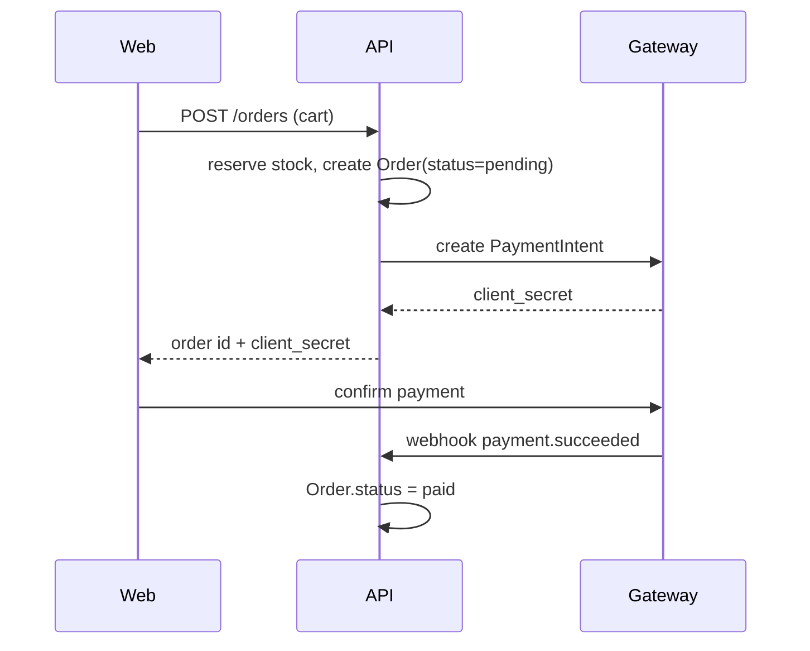

From "Place order" in the storefront to a `paid` order in the database.

## Diagram

## Steps

1. `web/app/checkout/page.tsx:40` posts the cart to `POST /orders`.
2. `api/src/orders/create.ts:22` reserves stock and creates the order as `pending`.
3. The payment intent is created with the [payment gateway](../integrations/payment-gateway.md).
4. `api/src/payments/webhook.ts:15` marks the order `paid` on `payment.succeeded`.

## Failure points

- Payment fails → order stays `pending`; a job cancels it after 30 minutes and releases stock (`api/src/orders/expire.ts:11`).
- Webhook arrives twice → idempotent by `event.id` (`api/src/payments/webhook.ts:20`).

## Related

- [Orders can be cancelled until they are shipped](../domain/order-cancellation.md)
