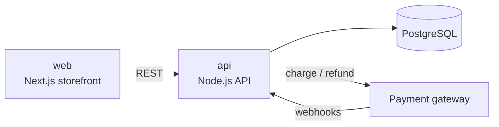

This is the knowledge base for **Acme**, a fictional online bookshop used as the example project. Replace this page with a description of your own ecosystem: what the product does, which systems exist and how they talk to each other.

> Everything under this folder is an example. Delete it (or run `npx create-ragu --no-example`) and start from the [templates](https://github.com/pedrohfonseca81/ragu/tree/main/template/templates).

## Systems

- [api](systems/api.md) — orders, catalogue, payments.
- [web](systems/web.md) — customer-facing storefront.

## Where to look

- Business rules → [Domain](domain/order-cancellation.md)
- How things happen end to end → [Flows](flows/checkout.md)
- Third parties → [Integrations](integrations/payment-gateway.md)
- Why things are the way they are → [Decisions](decisions/0001-single-api-service.md)
- Conventions → [Standards](standards/api-errors.md)
- Words → [Glossary](glossary.md)
