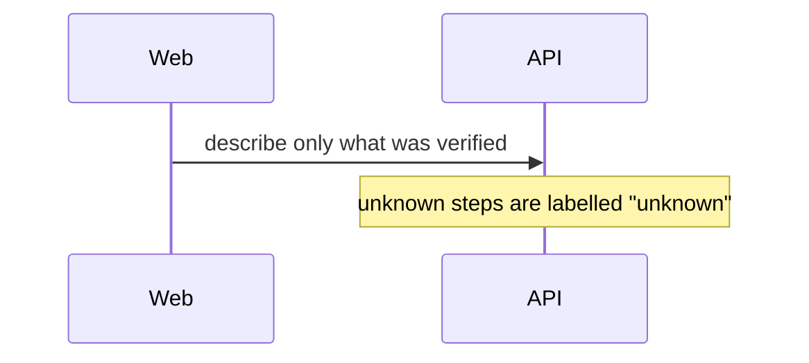

Two or three sentences: what the flow does and which systems take part.

## Diagram

## Steps

1. Step by step, with a source (`system/file:line`) for each verified step.

## Failure points

What can go wrong at each step and how the system reacts (or `Not documented`).

## Related

Links to related rules, decisions and flows.
